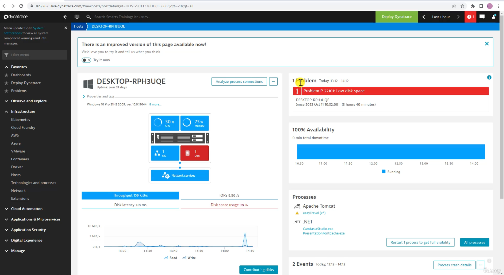

# Dynatrace Masterclass - The Complete Guide for Beginners

[course link](https://www.udemy.com/course/dynatrace-learning-tutorial)

[Dynatrace Tenant](https://asw86539.live.dynatrace.com/ui/dashboards?gtf=-2h&gf=all)

## Section 2: The Basics

- Create an account with Dynatrace
- Logging to Dynatrace
- Important: Latest interface vs classic View
- Deploy Dynatrace OneAgent

## Section 3: Infrastructure Observability

### Host Performance Data

#### Host Problem Alerting

Dynatrace can alert you when a host is having problems. You can configure the alerting rules in the `Settings` -> `Anomaly Detection` -> `Hosts` -> `Host availability` section.

[Resource Events](https://docs.dynatrace.com/docs/platform/davis-ai/basics/events/event-types/resource-events)

#### Host Availability

Host availability is the percentage of time that a host is available. It is calculated as the time the host is available divided by the total time.

- When its running its blue and when its offline its red.
- Offline does not mean the host is down, it could be that the agent is not running or there could be a communication error.
- It will also show the Maintenance window if one is set.

## Section 4: Cloud Automation
